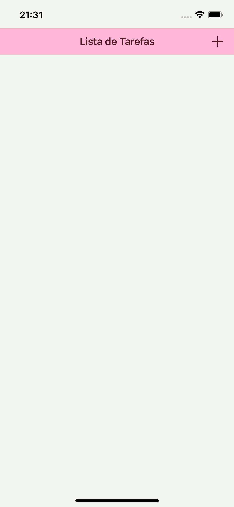
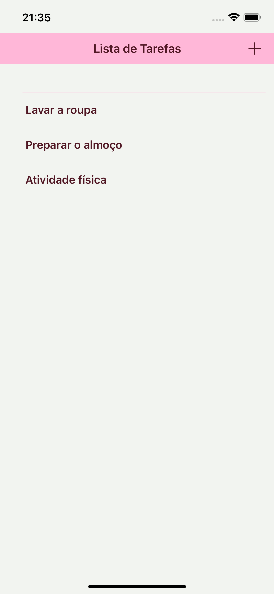
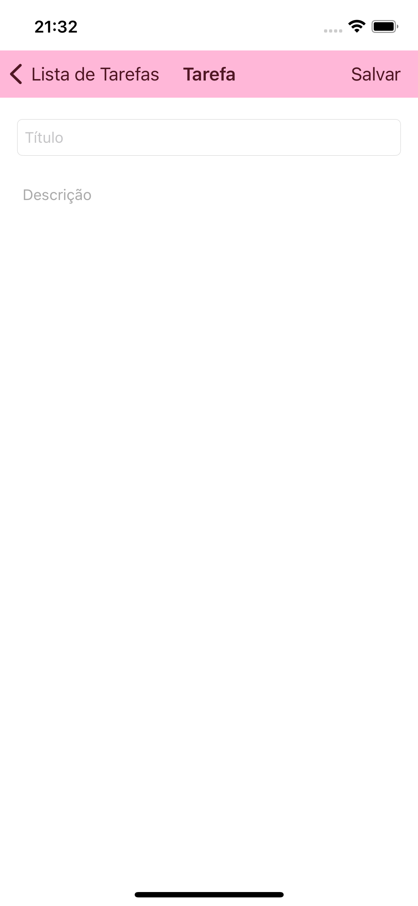
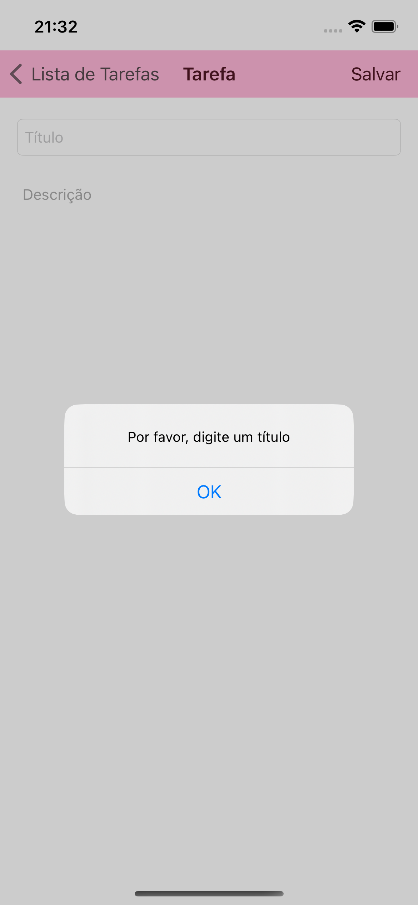
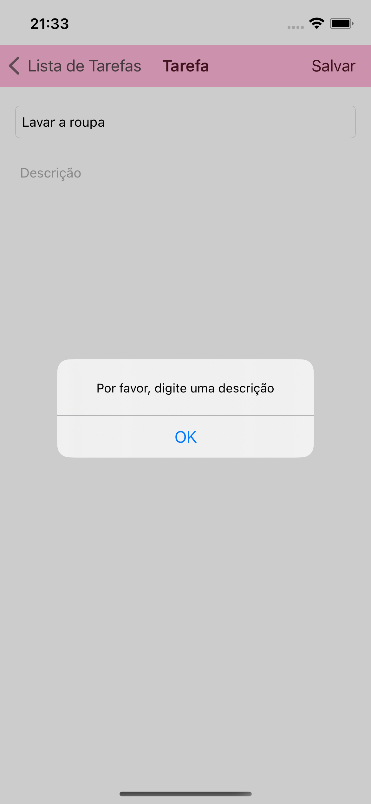
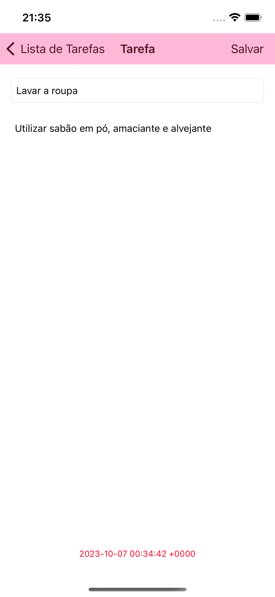
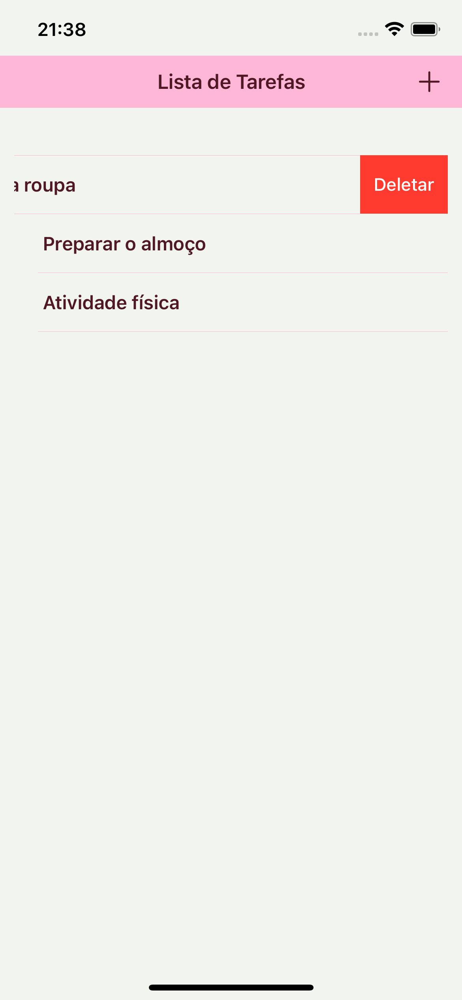

# Desafio-Evoluservices

## Desafio técnico iOS - Lista de tarefas

O aplicativo permite a criação de uma lista de tarefas que é salva diretamente na memória do dispositivo, permitindo que os dados persistam sempre que o aplicativo for encerrado.

## Tela inicial

Um exemplo da tela inicial vazia e com dados preenchidos:

<kbd>
  
  
</kbd>

Para adicionar uma nova tarefa, o usuário deverá clicar no botão "+" no canto superior direito da tela inicial.

## Nova tarefa

Ao clicar para adicionar uma nova tarefa, o usuário encontrará uma tela com dois campos para preencher, o título e a descrição da tarefa, conforme mostrado abaixo:

<kbd>
  
</kbd>

Para cancelar a criação de tarefas, basta clicar em "Lista de Tarefas" para voltar para a tela inicial.

Para criar uma nova tarefa, o usuário deverá preencher ambos os campos e clicar em "Salvar" que o usuário será redirecionado para a tela inicial já com a nova tarefa sendo exibida na lista.

Caso um dos campos esteja vazio, irá aparecer um alerta informando o erro, conforme mostrado abaixo:

<kbd>
  
  
</kbd>

## Editar tarefa

Caso haja tarefas salvas, o usuário pode clicar na tarefa que deseja editar e será redirecionado para a tela de detalhes com os campos de título e descrição para poderem ser editados. Na parte inferior será mostrada a data e horário quando foi criada a tarefa.

Exemplo:

<kbd>
  
</kbd>

Após editar a tarefa, basta clicar em "Salvar" que o usuário será redirecionado para a tela inicial e a tarefa já será exibida com suas devidas alterações.

## Deletar tarefa

Para deletar uma tarefa há dois modos, deslizar a célula com a tarefa da esquerda para a direita completamente ou apenas até aparecer o botão "Deletar" e clicar no mesmo.

Exemplo:

<kbd>
  
</kbd>
